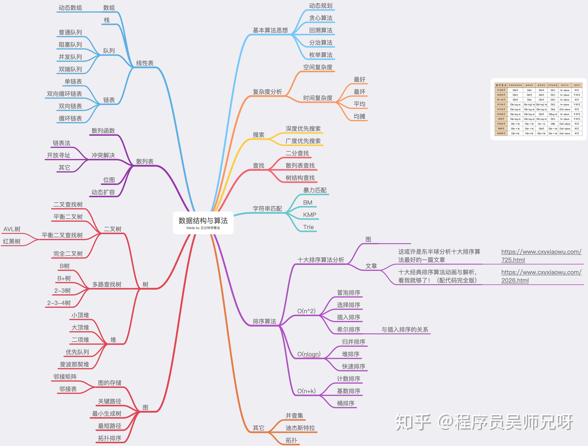

数据结构的源码实现以及本地调试使用的数据模拟，以便更好的理解数据结构与算法。学算法还有其他知识作为基础，其对应的目录下是学习资料以及总结。

## 文章参考

- [冰与火之歌：「时间」与「空间」复杂度](https://www.cxyxiaowu.com/1959.html)
- [这或许是东半球分析十大排序算法最好的一篇文章](https://www.cxyxiaowu.com/725.html)
- [令你迷惑的位运算](https://juejin.cn/post/6900710763657166855)
- [动态规划十连](https://juejin.cn/post/6937193443953393700)
- [回溯算法入门级详解](https://leetcode-cn.com/problems/permutations/solution/hui-su-suan-fa-python-dai-ma-java-dai-ma-by-liweiw)
